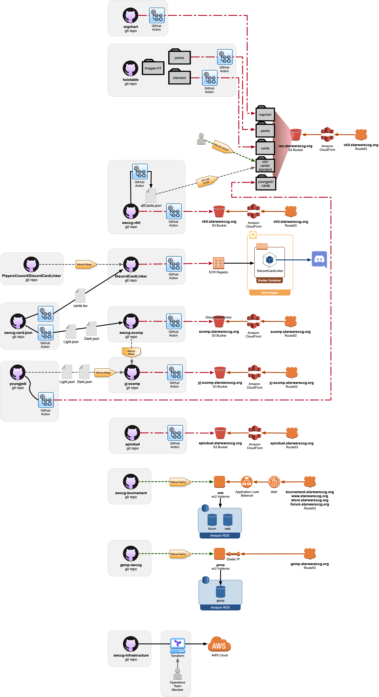
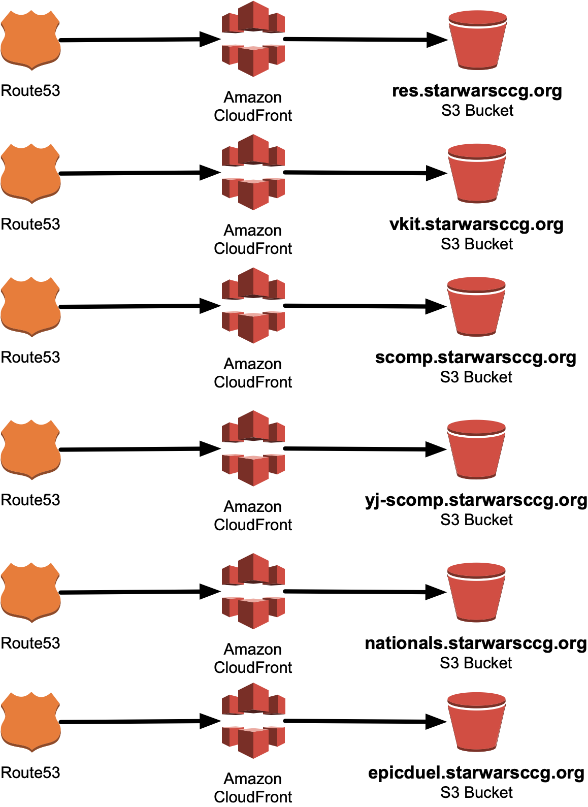
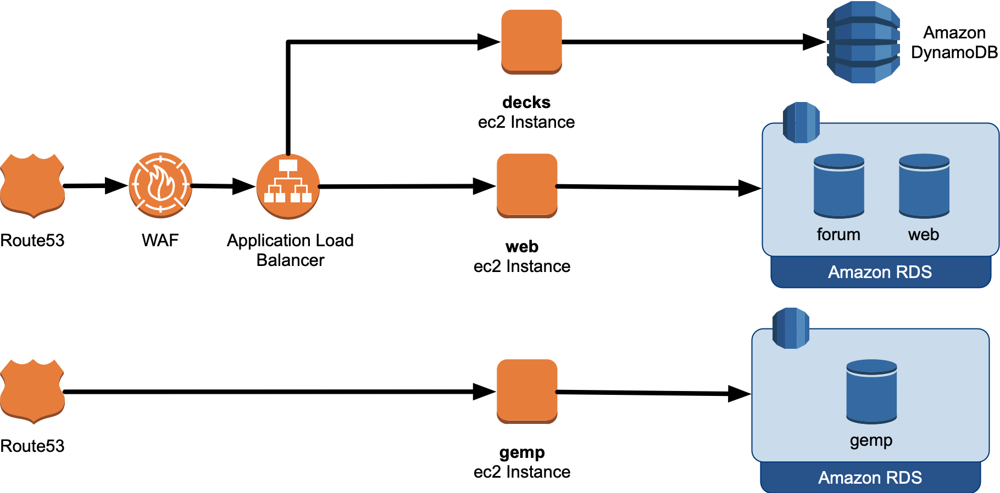

## SWCCG Git Repos

* The **resources** *(res)* s3 bucket hosts many assets used by many sites, such as scomp, vkit, www, and gemp.
* **GitHub Actions** automate upload from various Git repos to `res`.
* Terraform controls the creation of infrastructure within AWS.

## CloudFront on S3 Websites

* Static websites are hosted on Amazon S3.
* Amazon S3 is fronted by Amazon CloudFront.
* SSL Certificates are generated, *automatically*, use Amazon Certificate Manager *(ACM)*.
* `res.starwarsccg.org` stands for **resources**. The resources (res) are used by other sites, such as scomp, vkit, www, and gemp.

## EC2 Websites

* Web applications that are not static and require an application server to operate, such as PHP or Java, run on top of Amazon EC2 instances.
* The database backends are hosted in Amazon RDS _(relational database service)_.

# Git

## Branch Naming

* The Trunk branches should always be named `main`.
* The one exception to that is with `holotable` where the client code has a hard requirement on the name `master`. Once the client code can be updated to support `main` instead of `master` the git repo trunk branch will be renamed.

## Contributing code

* Always fork the code base, create a new branch, and create a pull request from the fork.
* Never pull and push from the primary repo.
* Never create short lived branches on the primary repo.

